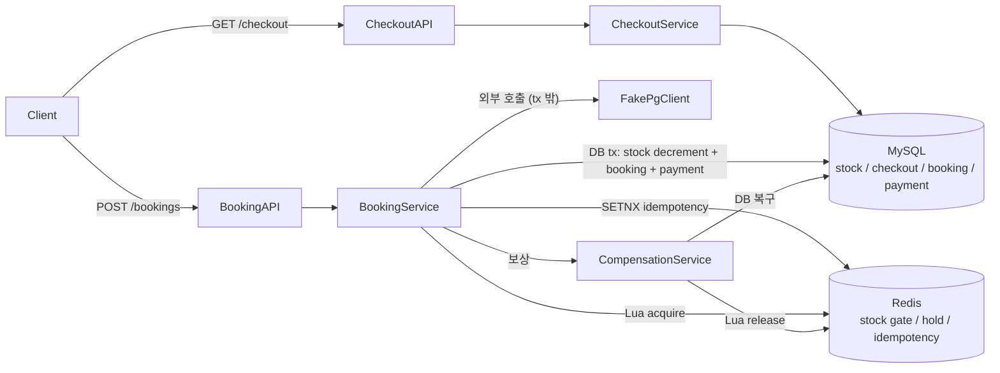
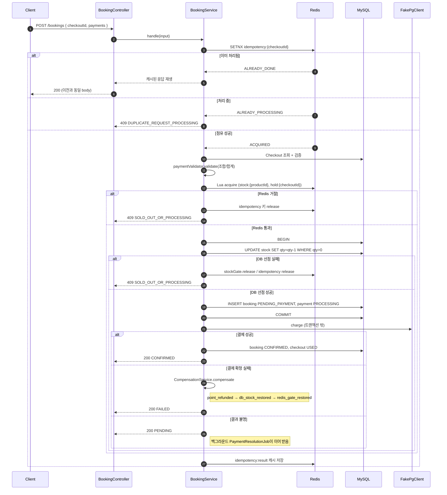
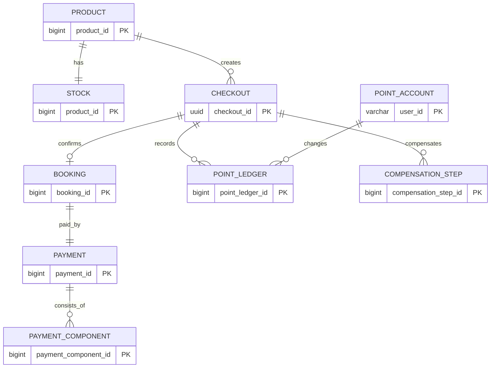

# hello-pani

00시 오픈 한정 상품 선착순 예약 / 결제 시스템.

- 한정 재고 10개를 두고 분당 30,000 ~ 60,000건 규모의 트래픽이 쏠리는 상황을 가정한다.
- 핵심은 **거절을 빠르고 공정하게 수행하는 시스템**이다. 정상 운영 상태에서 정확히 10건만 성공하고 어떤 경우에도 초과 판매를 만들지 않는다.

더 자세히 보고 싶으면 다음 문서를 본다.

- [docs/DECISIONS.md](docs/DECISIONS.md) — 왜 그렇게 선택했는가
- [docs/DOMAIN.md](docs/DOMAIN.md) — 무엇을 만들었는가
- [docs/TASKS.md](docs/TASKS.md) — 구현 순서와 완료 체크리스트

## 사전 준비

이 프로젝트를 로컬에서 실행하려면 다음이 필요하다. macOS / Linux 기준 설치 안내를 같이 적는다.

| 도구 | 용도 | macOS (Homebrew) | Linux (Ubuntu/Debian) |
|---|---|---|---|
| **Java 21** | 앱 빌드 / 실행 | `brew install --cask temurin@21` | `sudo apt install openjdk-21-jdk` |
| **Docker Engine + Compose v2** | MySQL / Redis 컨테이너 | [Docker Desktop](https://www.docker.com/products/docker-desktop/) 또는 `brew install colima docker docker-compose` | [docker.com 공식 가이드](https://docs.docker.com/engine/install/ubuntu/) (`docker-ce` + `docker-compose-plugin`) |
| **curl** | API 예시 호출 | 기본 포함 | `sudo apt install curl` |
| **k6** *(부하 검증 시)* | 정합성 / 멱등성 시나리오 | `brew install k6` | [Grafana k6 공식 가이드](https://grafana.com/docs/k6/latest/set-up/install-k6/#linux) |
| **jq** *(메트릭 조회 시)* | actuator 메트릭 JSON 파싱 | `brew install jq` | `sudo apt install jq` |

설치 후 버전 확인:

```bash
java -version       # 21.x
docker --version
docker compose version
k6 version          # 부하 검증 시
jq --version        # 메트릭 조회 시
```

> Java 21이 설치되어 있지 않다면 [SDKMAN!](https://sdkman.io/) (`sdk install java 21-tem`)도 macOS / Linux 모두에서 잘 동작한다.
>
> Linux에서 `docker compose` 명령은 Compose v2 플러그인을 별도로 설치해야 한다. 구버전 `docker-compose` (하이픈) 대신 `docker compose` (공백)를 쓴다.
>
> Docker는 데몬 권한이 필요하다. macOS는 Docker Desktop / colima 실행으로 충분하고, Linux는 `sudo usermod -aG docker $USER` 후 재로그인하면 sudo 없이 사용할 수 있다.

## 빠른 실행

```bash
./gradlew bootRun
```

Spring Boot Docker Compose가 `docker-compose.yml`을 감지해 MySQL / Redis를 자동 기동한다. 기동이 끝나면:

```bash
curl -s http://localhost:8080/actuator/health
# {"status":"UP",...}
```

## 수동 인프라 실행

Docker 인프라를 직접 띄우고 싶으면:

```bash
docker compose up -d
./gradlew bootRun
```

`docker-compose.yml`은 MySQL과 Redis 정의의 단일 원천이다. 어떤 경로로 띄워도 같은 인프라가 올라온다.

## API

### GET /checkout — 주문서 발급

```bash
curl -s "http://localhost:8080/checkout?productId=1" \
     -H "X-User-Id: test-user-1"
```

응답 예:

```json
{
  "checkoutId": "f4c8...uuid",
  "product": {
    "name": "한정 패키지",
    "price": 150000,
    "imageUrl": "https://example.com/p1.jpg",
    "checkInAt": "2026-06-01T15:00:00",
    "checkOutAt": "2026-06-02T11:00:00"
  },
  "availablePoint": 50000,
  "expiresAt": "2026-05-02T15:40:00"
}
```

- 잔여 재고 수량은 응답에 포함하지 않는다.
- GET Checkout은 의도적으로 비멱등이다. 같은 사용자가 다시 호출하면 새 `checkoutId`를 받는다.

### POST /bookings — 결제 + 예약 확정

```bash
curl -s -X POST "http://localhost:8080/bookings" \
     -H "X-User-Id: test-user-1" \
     -H "Content-Type: application/json" \
     -d '{
       "checkoutId": "f4c8...uuid",
       "payments": [{"method": "CARD", "amount": 150000}]
     }'
```

응답 예 (성공):

```json
{
  "checkoutId": "f4c8...uuid",
  "status": "CONFIRMED",
  "bookingId": 1,
  "paymentId": 1,
  "message": null
}
```

응답 형태 요약:

| HTTP | status | 의미 |
|---|---|---|
| 200 | `CONFIRMED` | 결제 + 예약 확정 |
| 200 | `FAILED` | 결제 확정 실패. 재고 / 포인트 보상 완료 |
| 200 | `PENDING` | PG 결과 불명. 결과 조회 잡이 후속 처리 |
| 400 | - | 결제 조합 / 금액 불일치 / Checkout 만료 |
| 403 | - | Checkout 사용자 불일치 |
| 404 | - | Checkout / 상품 없음 |
| 409 | `SOLD_OUT_OR_PROCESSING` | Redis gate 또는 DB 재고 선점 실패 |
| 409 | `DUPLICATE_REQUEST_PROCESSING` | 같은 checkoutId 중복 요청 처리 중 |
| 503 | `REDIS_UNAVAILABLE` | Redis 장애. `Retry-After` 포함 |

결제 수단 조합:

- 허용: `CARD`, `Y_PAY`, `POINT`, `CARD + POINT`, `Y_PAY + POINT`
- 금지: `CARD + Y_PAY`

같은 `checkoutId`로 중복 POST하면 첫 처리 결과가 그대로 재생된다.

### Fake PG 트리거 금액

실제 PG SDK 대신 [`FakePgClient`](src/main/java/com/example/hellopani/payment/infra/FakePgClient.java)가 다음 금액으로 결제 결과를 시뮬레이션한다.

| 금액 | 결과 |
|---|---|
| `999999` | LIMIT_EXCEEDED (한도 초과) |
| `999998` | CARD_DECLINED (카드사 거절) |
| `999997` | RESULT_PENDING (PG 결과 불명) |
| 그 외 | 성공 |

## 아키텍처



핵심 불변식:

- **Redis는 게이트, DB는 진실.** Redis gate 통과는 예약 성공이 아니라 DB 재고 선점 시도권이다.
- **결제는 DB 재고 선점 뒤에만 호출한다.** 결제 성공인데 재고 없음을 구조적으로 막는다.
- **DB 트랜잭션을 잡은 채 외부 PG를 호출하지 않는다.**
- **Redis 장애 시 DB 우회 차감 없음.** 503 + Retry-After로 fail-fast.

## POST Booking 시퀀스



## 데이터 모델

### ERD



### DDL

전체 스키마는 [`src/main/resources/schema.sql`](src/main/resources/schema.sql)에서 관리한다. 핵심 테이블:

```sql
CREATE TABLE IF NOT EXISTS stock (
    product_id BIGINT      NOT NULL,
    qty        INT         NOT NULL,
    updated_at DATETIME(6) NOT NULL DEFAULT CURRENT_TIMESTAMP(6),
    PRIMARY KEY (product_id),
    CONSTRAINT chk_stock_qty CHECK (qty >= 0),
    CONSTRAINT fk_stock_product FOREIGN KEY (product_id) REFERENCES product (product_id)
);

CREATE TABLE IF NOT EXISTS booking (
    booking_id   BIGINT      NOT NULL AUTO_INCREMENT,
    checkout_id  CHAR(36)    NOT NULL,
    user_id      VARCHAR(64) NOT NULL,
    product_id   BIGINT      NOT NULL,
    status       VARCHAR(20) NOT NULL,
    total_amount BIGINT      NOT NULL,
    created_at   DATETIME(6) NOT NULL DEFAULT CURRENT_TIMESTAMP(6),
    confirmed_at DATETIME(6) NULL,
    PRIMARY KEY (booking_id),
    CONSTRAINT uk_booking_checkout UNIQUE (checkout_id),
    CONSTRAINT chk_booking_status CHECK (status IN ('PENDING_PAYMENT','CONFIRMED','FAILED'))
);

CREATE TABLE IF NOT EXISTS payment (
    payment_id          BIGINT      NOT NULL AUTO_INCREMENT,
    checkout_id         CHAR(36)    NOT NULL,
    booking_id          BIGINT      NOT NULL,
    user_id             VARCHAR(64) NOT NULL,
    status              VARCHAR(20) NOT NULL,
    total_amount        BIGINT      NOT NULL,
    pg_idempotency_key  VARCHAR(64) NOT NULL,
    created_at          DATETIME(6) NOT NULL DEFAULT CURRENT_TIMESTAMP(6),
    completed_at        DATETIME(6) NULL,
    PRIMARY KEY (payment_id),
    CONSTRAINT uk_payment_checkout UNIQUE (checkout_id),
    CONSTRAINT chk_payment_status CHECK (status IN
        ('PROCESSING','RESULT_PENDING','SUCCEEDED','FAILED','COMPENSATING','COMPENSATED','REFUND_FAILED'))
);

CREATE TABLE IF NOT EXISTS compensation_step (
    compensation_step_id BIGINT      NOT NULL AUTO_INCREMENT,
    checkout_id          CHAR(36)    NOT NULL,
    step                 VARCHAR(32) NOT NULL,
    completed_at         DATETIME(6) NOT NULL DEFAULT CURRENT_TIMESTAMP(6),
    PRIMARY KEY (compensation_step_id),
    CONSTRAINT uk_compensation_step UNIQUE (checkout_id, step),
    CONSTRAINT chk_compensation_step CHECK (step IN
        ('POINT_REFUNDED','DB_STOCK_RESTORED','REDIS_GATE_RESTORED'))
);
```

씨드 데이터: 한정 상품 1개(`product_id=1`, 가격 150,000), `stock.qty=10`, `point_account('test-user-1', 50000)`.

## 장애 정책

### Redis 장애

- `tryAcquire` / `idempotencyService.tryAcquire`는 Resilience4j Circuit Breaker(`name=redis`)와 timeout 200ms로 보호된다.
- 장애 감지 시 `RedisUnavailableException`이 던져지고 컨트롤러는 `503 Service Unavailable` + `Retry-After`를 응답한다.
- 어떤 경우에도 DB 우회 차감으로 떨어지지 않는다. 통합 테스트 [`RedisFailFastTest`](src/test/java/com/example/hellopani/booking/api/RedisFailFastTest.java)가 이 불변식을 강제한다.

### 결제 실패 보상

`CompensationService`가 다음 3단계를 `compensation_step` 테이블의 단계 기록으로 멱등하게 재시도한다.

1. `POINT_REFUNDED` — 차감된 포인트 복구 (point_ledger UNIQUE로 자체 멱등)
2. `DB_STOCK_RESTORED` — `stock.qty` 복구 (DB 트랜잭션 안에서 effect + step insert)
3. `REDIS_GATE_RESTORED` — Redis hold 해제 + stock counter 복구 (Lua가 자체 멱등)

각 단계는 이미 `compensation_step`에 완료 기록이 있으면 건너뛴다. 끝까지 실패하면 `Payment.status = REFUND_FAILED`로 마킹하고 `compensation.refund_failed` Micrometer counter가 증가한다.

### PG 결과 불명

`PaymentResolutionJob`이 `RESULT_PENDING` 상태의 Payment를 주기적으로 `checkoutId / pg_idempotency_key`로 PG에 재조회한다.

- `Approved` → SUCCEEDED + Booking CONFIRMED + Checkout USED
- `Declined` → 보상 실행
- `Pending` / `NotFound` → `hold:{checkoutId}` TTL 연장 후 다음 사이클까지 대기

만료 정리는 `ExpiryCleanupJob`이 담당한다. **`SUCCEEDED` Payment는 절대 건드리지 않는다.**

## 검증

### 단위 / 통합 테스트

```bash
./gradlew test
```

- 135 tests, 0 failures
- 테스트는 Spring Boot Docker Compose가 띄운 실제 MySQL / Redis로 실행된다.

### k6 부하 시나리오

아래 스크립트는 앱이 이미 떠 있으면 그대로 사용하고, 떠 있지 않으면 `./gradlew bootRun`을 백그라운드로 띄운 뒤 검증한다.

```bash
./scripts/test-consistency.sh  # 50 VU 동시 진입 → 정확히 10건 CONFIRMED
./scripts/test-idempotency.sh  # 같은 checkoutId 20 VU → Booking/Payment 1건
./scripts/test-load.sh         # 피크 부하 (1,000 RPS / 60s, build/load-report.md 생성)
./scripts/test-all.sh          # ./gradlew test --rerun-tasks + k6 2종
```

피크 부하 시나리오와 보고서는 [docs/LOAD.md](docs/LOAD.md)에 한 페이지로 정리되어 있다.

통과 기준 (k6 thresholds 자동 검증):

| 시나리오 | 자동 기준 |
|---|---|
| `consistency.js` | `booking_confirmed_total == 10`, `booking_error_total == 0` |
| `idempotency.js` | `booking_confirmed_total >= 1`, `booking_failed_total == 0`, `booking_error_total == 0` |

idempotency 추가 수동 검증:

```bash
docker compose exec -T mysql mysql -u hellopani -phellopani hellopani -e "
  SELECT COUNT(*) AS bookings FROM booking;
  SELECT COUNT(*) AS payments FROM payment;
  SELECT qty FROM stock WHERE product_id = 1;
"
# 기대: bookings=1, payments=1, qty=9
```

각 스크립트는 실행 전에 `./k6/reset.sh`로 DB / Redis 상태를 초기화한다.
이미 초기화한 상태를 유지하고 싶으면 `SKIP_RESET=true`를 붙인다.

```bash
SKIP_RESET=true ./scripts/test-consistency.sh
```

### 메트릭 확인

```bash
curl -s http://localhost:8080/actuator/metrics/booking.confirmed
curl -s http://localhost:8080/actuator/metrics/redis.gate.failure?tag=reason:SOLD_OUT_OR_PROCESSING
```

커스텀 메트릭 목록은 [docs/DOMAIN.md](docs/DOMAIN.md#검증과-관측)에 요약되어 있다.

## 하지 않은 것

이 프로젝트는 다음을 만들지 않는다. 문서나 응답 어디서도 구현된 것처럼 약속하지 않는다.

- 회원가입 / 로그인 / 권한 시스템
- 실제 PG SDK 연동 (Fake로 대체)
- 쿠폰, 장바구니, 정산, 매출 리포트, 관리자 API
- 대기열 UI, SSE, polling
- 잔여 재고 사용자 노출
- Redis Cluster 기본 구성 (선택 확장)
- Prometheus remote-write / Grafana dashboard (선택 확장)
- k6 스파이크 / Redis 장애 자동 시나리오 (선택 확장)
