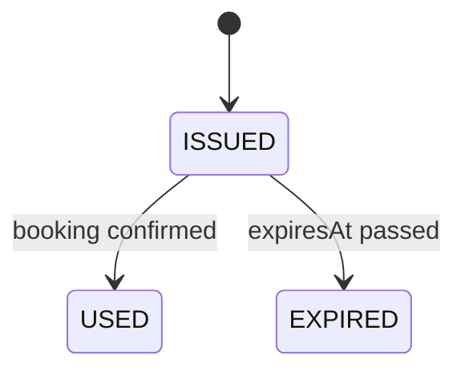
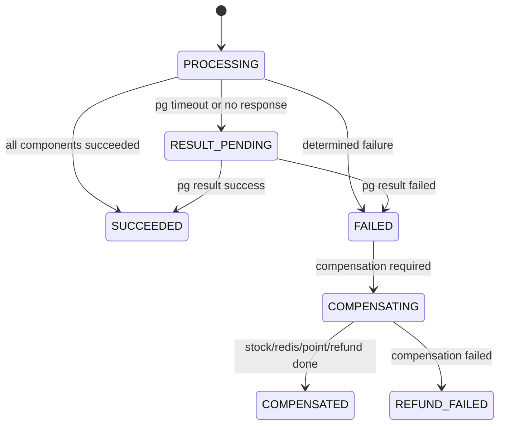
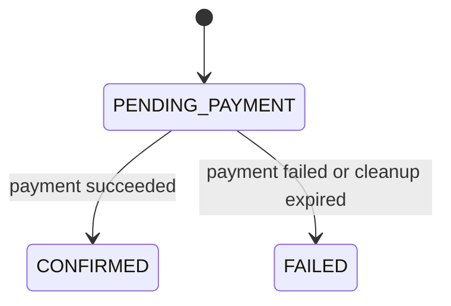
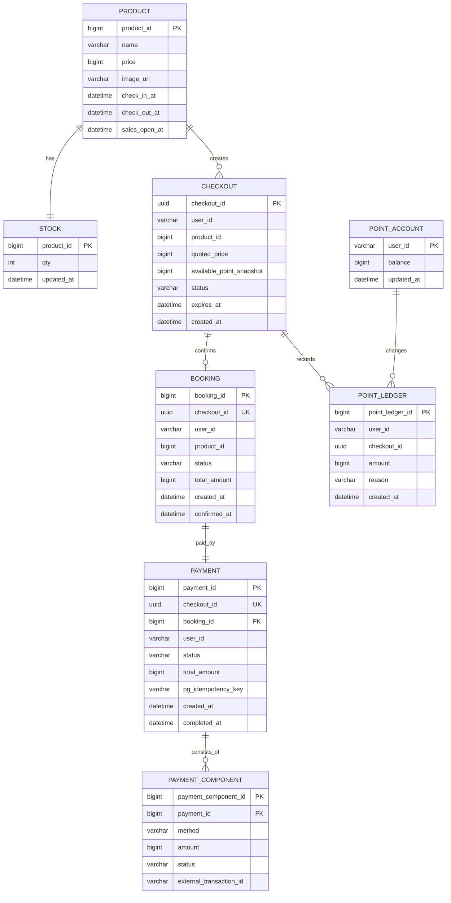

# DOMAIN

이 문서는 00시 오픈 한정 상품 선착순 예약 / 결제 시스템의 도메인 설계를 정리한다.
목표는 필수 요구사항을 만족하는 최소 모델을 먼저 정의하고, 있으면 좋은 것과 의도적으로 제외할 것을 분리하는 것이다.

## 설계 원칙

- **YAGNI 우선**: 요구사항 검증에 직접 필요하지 않은 도메인은 만들지 않는다.
- **성공보다 거절이 많은 시스템**: 재고 10개를 제외한 대부분의 요청은 빠르게 실패한다.
- **DB는 최종 진실**: Redis는 게이트와 멱등성 조기 차단에 사용하고, 최종 주문 / 결제 / 재고 기록은 DB가 가진다.
- **Redis 통과는 성공이 아니다**: Redis gate는 DB에 진입할 후보 수를 제한할 뿐이다. 예약 가능 여부는 DB stock 조건부 UPDATE 성공으로 확정한다.
- **장애 시 정합성 우선**: Redis 장애나 결과 불명 상태에서는 DB로 우회 판매하지 않는다. 남은 재고가 있어도 안전하게 판단할 수 없으면 fail-fast한다.
- **외부 PG는 인터페이스로만 표현**: 실제 PG 연동은 생략하되, 멱등키 / 결과 조회 / 실패 처리는 도메인 흐름에 포함한다.
- **회원 인증은 제외**: 사용자는 `X-User-Id` 헤더로 식별된다고 가정한다.

## 요구사항 분류

### 필수

| 요구 | 도메인 반영 |
|---|---|
| GET Checkout API | 상품 정보, 가격, 입/퇴실 시간, 사용 가능 포인트, checkoutId 발급 |
| POST Booking API | checkoutId 기반 예약 / 결제 / 주문 생성 |
| 재고 10개 정합성 | Redis 게이트는 후보 수를 제한하고, DB 조건부 UPDATE가 최종 재고 선점을 확정 |
| 선착순 공정성 | 단일 Redis 게이트에서 서버 도달 순서 기준 처리 |
| 멱등성 | checkoutId를 내부 멱등키이자 PG 멱등키로 사용 |
| 결제 수단 | 카드, Y페이, Y포인트 |
| 복합 결제 | 카드 + 포인트, Y페이 + 포인트 허용 |
| 금지 조합 | 카드 + Y페이 금지 |
| 결제 실패 처리 | 확정 실패는 보상, 결과 불명은 PG 결과 조회 재시도 |
| Redis 장애 대응 | fail-fast, DB 우회 차감 금지 |
| 실패 후 재고 복구 | DB stock 복구 + Redis gate 복구. 복구된 재고는 이후 재시도 요청이 획득 |

### 있으면 좋은 것

| 항목 | 이유 | 이번 설계 반영 수준 |
|---|---|---|
| 운영자용 잔여 재고 조회 | 장애 대응과 검증에 유용 | 내부 메트릭 / DB 조회 기준만 둔다 |
| 결제 결과 조회 재시도 잡 | PG 응답 미수신 처리에 필요 | 도메인 상태와 정책만 정의 |
| 부하 테스트 시나리오 | 정합성 검증에 유용 | `DECISIONS.md`와 README에서 다룬다 |
| Redis Cluster / Sentinel | 가용성 보강 | 기본 도메인에는 넣지 않고 인프라 옵션으로 둔다 |
| Grafana 대시보드 | 운영 가시성 | 도메인 모델에는 포함하지 않는다 |

### 하지 않을 것

| 항목 | 제외 이유 |
|---|---|
| 회원가입 / 로그인 / 권한 | 본 프로젝트 범위 외 |
| 쿠폰 / 프로모션 정책 | 요구사항 없음 |
| 장바구니 | 단일 상품 checkout으로 충분 |
| 여러 상품 동시 구매 | 한정 상품 1개 예약이 핵심 |
| 숙소 객실 캘린더 / 날짜별 재고 | 요구사항의 핵심은 한 상품 10개 재고 |
| 취소 정책 / 환불 규정 | 결제 실패 보상 외에는 요구사항 없음 |
| 정산 / 매출 리포트 | 예약 / 결제 성공 검증에 불필요 |
| 대기열 UI / SSE / polling | 동기 API로 요구사항 충족 가능 |
| 실제 PG 연동 | 인터페이스와 Fake 구현으로 충분 |
| 잔여 재고 사용자 노출 | 공정성 및 자동화 공격 방지 관점에서 제외 |

## 도메인 경계

| 영역 | 책임 | 포함 모델 |
|---|---|---|
| Catalog | 판매 상품 정보 제공 | Product |
| Checkout | 주문서 발급과 가격 / 포인트 스냅샷 | Checkout |
| Inventory | 재고 게이트와 최종 재고 차감 | Stock |
| Booking | 최종 예약 생성과 상태 관리 | Booking |
| Payment | 결제 조합 검증, 결제 실행, 보상 | Payment, PaymentComponent |
| Point | 포인트 잔액 조회와 차감 / 복구 | PointAccount, PointLedger |

## 핵심 도메인 모델

### Product

판매 대상 상품이다.

필수 속성:

- `productId`
- `name`
- `price`
- `imageUrl`
- `checkInAt`
- `checkOutAt`
- `salesOpenAt`

제외 속성:

- 상세 이미지 목록
- 취소 규정
- 숙소 위치 / 편의시설
- 날짜별 객실 재고

### Stock

상품의 최종 재고다. DB의 `stock.qty`가 최종 진실이다.

필수 속성:

- `productId`
- `qty`
- `updatedAt`

규칙:

- `qty`는 0 미만이 될 수 없다.
- 최종 차감은 `UPDATE stock SET qty = qty - 1 WHERE product_id = ? AND qty > 0`로 수행한다.
- 이 방식은 version 컬럼을 읽어 비교하는 낙관적 락이 아니다. Redis gate를 통과한 요청만 DB 단일 조건부 UPDATE로 재고를 선점한다.
- Redis 카운터는 빠른 거절을 위한 게이트이며 최종 진실이 아니다.

### Checkout

GET Checkout API가 발급하는 주문서다. POST Booking의 멱등키 역할도 한다.

필수 속성:

- `checkoutId`
- `userId`
- `productId`
- `quotedPrice`
- `availablePointSnapshot`
- `status`
- `expiresAt`
- `createdAt`

상태:

| 상태 | 의미 |
|---|---|
| `ISSUED` | 발급됨 |
| `USED` | 예약 생성에 사용됨 |
| `EXPIRED` | 결제 가능 시간이 지남 |

규칙:

- 같은 checkoutId로 들어온 POST Booking은 같은 결과를 반환해야 한다.
- GET Checkout은 의도적으로 비멱등이다. 다시 진입하면 새 checkoutId를 받는다.
- checkoutId는 PG 주문번호 또는 멱등키로도 전달한다.
- `expiresAt`은 매 POST Booking 요청 시 lazy 검증한다. 만료된 Checkout은 결제에 사용할 수 없다.
- 이미 DB stock을 reserve한 뒤 만료된 결제 시도는 백그라운드 정리 잡이 `FAILED` 처리하고 stock을 멱등 복구한다.

### Booking

예약 시도와 최종 예약을 함께 표현한다. 결제 전에는 `PENDING_PAYMENT`로 생성되고, DB 재고 선점 이후 결제까지 확정되면 `CONFIRMED`가 된다.

필수 속성:

- `bookingId`
- `checkoutId`
- `userId`
- `productId`
- `status`
- `totalAmount`
- `createdAt`
- `confirmedAt`

상태:

| 상태 | 의미 |
|---|---|
| `PENDING_PAYMENT` | 결제 결과 확정 대기 |
| `CONFIRMED` | DB 재고 선점 이후 결제까지 확정됨 |
| `FAILED` | 결제 실패 또는 만료 정리로 예약이 종료됨 |

규칙:

- `checkoutId`는 Booking에서 unique 해야 한다.
- `PENDING_PAYMENT` Booking, `PROCESSING` Payment 생성과 DB 재고 선점은 같은 DB 트랜잭션 안에서 수행한다.
- 외부 PG 호출은 이 트랜잭션을 커밋한 뒤 시작한다. DB 트랜잭션을 잡은 채 외부 호출을 기다리지 않는다.
- `CONFIRMED` 상태의 Booking 수는 상품 재고보다 많을 수 없다.
- `FAILED` Booking은 감사와 멱등 응답 확인을 위해 남긴다.
- 사용자 취소 / 환불 완료 후의 예약 취소는 이번 범위에서 제외한다.

### Payment

예약에 대한 결제 묶음이다.

필수 속성:

- `paymentId`
- `checkoutId`
- `bookingId`
- `userId`
- `status`
- `totalAmount`
- `pgIdempotencyKey`
- `createdAt`
- `completedAt`

상태:

| 상태 | 의미 |
|---|---|
| `PROCESSING` | 결제 처리 중 |
| `RESULT_PENDING` | PG 결과 조회 대기 |
| `SUCCEEDED` | 결제 성공 |
| `FAILED` | 결제 실패 |
| `COMPENSATING` | 포인트 복구 / PG 환불 / stock 복구 진행 중 |
| `COMPENSATED` | 실패 후 보상 완료 |
| `REFUND_FAILED` | 보상 실패. 운영자 알림 대상 |

규칙:

- `pgIdempotencyKey`는 현재 checkoutId와 동일하게 둔다. 다만 외부 PG 추적용 키임을 명시하고, PG 키 정책이 바뀔 때 내부 멱등키와 분리할 수 있도록 별도 컬럼으로 보관한다.
- PG 타임아웃 / 응답 미수신 시 같은 키로 결제 결과를 조회한다.
- 결과 조회가 성공이면 예약 확정으로 이어지고, 실패이면 보상한다.
- 조회 한도 초과 또는 PG 장애 지속 시에만 운영자 알림 대상이 된다.

결제 실패 분류와 상태 매핑:

| 분류 | Payment 상태 | PaymentComponent 상태 | 보상 |
|---|---|---|---|
| 한도 초과 | `FAILED` → `COMPENSATING` → `COMPENSATED` | 해당 component `FAILED` | DB stock 복구 + Redis gate 복구. 이미 차감된 포인트가 있으면 포인트 복구 |
| 카드 거절 | `FAILED` → `COMPENSATING` → `COMPENSATED` | 해당 component `FAILED` | DB stock 복구 + Redis gate 복구. 이미 차감된 포인트가 있으면 포인트 복구 |
| 잔액 부족 | `FAILED` → `COMPENSATING` → `COMPENSATED` | `POINT` component `FAILED` | PG 호출 전 실패. DB stock 복구 + Redis gate 복구 |
| PG 타임아웃 | `RESULT_PENDING` → 결과에 따라 `SUCCEEDED` 또는 `FAILED` | 해당 component `PENDING` | checkoutId로 PG 결과 조회 후 결정 |
| PG 응답 미수신 | `RESULT_PENDING` → 결과에 따라 `SUCCEEDED` 또는 `FAILED` | 해당 component `PENDING` | checkoutId로 PG 결과 조회 후 결정 |
| 보상 실패 | `REFUND_FAILED` | 보상 대상 component 상태 유지 | 운영자 알림. checkoutId 기준 재실행 가능해야 함 |

### PaymentComponent

카드 / Y페이 / 포인트 각각의 결제 단위다.

필수 속성:

- `paymentComponentId`
- `paymentId`
- `method`
- `amount`
- `status`
- `externalTransactionId`

결제 수단:

| method | 설명 |
|---|---|
| `CARD` | 신용카드 |
| `Y_PAY` | Y페이 |
| `POINT` | Y포인트 |

허용 조합:

- `CARD`
- `Y_PAY`
- `POINT`
- `CARD + POINT`
- `Y_PAY + POINT`

금지 조합:

- `CARD + Y_PAY`
- `CARD + Y_PAY + POINT`

규칙:

- 모든 component 금액 합은 상품 가격과 같아야 한다.
- 포인트 결제는 외부 PG가 아니라 내부 포인트 잔액 차감으로 처리한다.
- 복합결제 중 일부 실패 시 이미 성공한 component는 역순으로 보상한다.

### PointAccount

사용자 포인트 잔액이다.

필수 속성:

- `userId`
- `balance`
- `updatedAt`

규칙:

- 잔액은 0 미만이 될 수 없다.
- 포인트 차감은 원자적으로 수행한다.
- 포인트 부족은 확정 실패이므로 즉시 결제 실패로 처리한다.

### PointLedger

포인트 변경 이력이다.

필수 속성:

- `pointLedgerId`
- `userId`
- `checkoutId`
- `amount`
- `reason`
- `createdAt`

규칙:

- 차감은 음수, 복구는 양수로 기록한다.
- checkoutId와 reason 조합은 멱등해야 한다.
- 단순 잔액만 두면 보상 검증이 어려우므로 ledger는 필수에 포함한다.

reason 값:

| reason | 의미 | 금액 방향 |
|---|---|---|
| `BOOKING_USE` | 결제에 포인트 사용 | 음수 |
| `BOOKING_REFUND` | 결제 실패로 포인트 복구 | 양수 |
| `BOOKING_RESTORE` | 보상 재실행 / 정리 잡에 의한 복구 | 양수 |

## API 유스케이스

### GET Checkout

목적:

- 상품 정보 조회
- 사용자 사용 가능 포인트 조회
- checkoutId 발급

입력:

- Header: `X-User-Id`
- Query: `productId`

응답:

- `checkoutId`
- `product`
    - `name`
    - `price`
    - `imageUrl`
    - `checkInAt`
    - `checkOutAt`
- `availablePoint`
- `expiresAt`

도메인 흐름:

1. userId를 헤더에서 읽는다.
2. Product를 조회한다.
3. PointAccount에서 사용 가능 포인트를 조회한다.
4. Checkout을 `ISSUED` 상태로 생성한다.
5. checkoutId와 주문서 정보를 반환한다.

하지 않는 것:

- 재고 선점
- 결제 수단 검증
- 잔여 재고 사용자 노출

### POST Booking

목적:

- checkoutId 기반으로 결제하고 최종 예약을 생성한다.

입력:

- Header: `X-User-Id`
- Body:
    - `checkoutId`
    - `payments[]`
        - `method`
        - `amount`

도메인 흐름:

1. checkoutId 멱등키를 Redis `SETNX`로 점유한다.
2. Checkout을 조회하고 사용자 / 만료 여부를 검증한다. 이 단계에서 실패하면 `idempotency:{checkoutId}`를 삭제한다.
3. 결제 조합과 금액 합계를 검증한다. 이 단계에서 실패하면 `idempotency:{checkoutId}`를 삭제한다.
4. Redis 재고 게이트에서 점유 토큰을 얻는다.
5. DB 트랜잭션에서 Stock을 조건부 UPDATE로 선점하고 Booking `PENDING_PAYMENT`, Payment `PROCESSING`을 생성한 뒤 커밋한다.
6. 트랜잭션 밖에서 PaymentComponent를 순서대로 실행한다.
7. PG 호출에는 checkoutId를 멱등키로 전달한다.
8. PG 타임아웃 / 응답 미수신이면 같은 checkoutId로 결과 조회를 재시도한다.
9. 결제가 성공하면 Booking을 `CONFIRMED`로 변경한다.
10. Checkout을 `USED`로 변경한다.
11. 멱등 결과를 Redis에 캐시하고 응답한다.

실패 흐름:

| 실패 지점 | 처리 |
|---|---|
| Redis 멱등키 점유 실패 | 기존 결과 재생 또는 `409 processing` |
| Checkout 없음 / 만료 / 사용자 불일치 | `400` 또는 `403`, 재고 게이트 진입 전 실패. SETNX로 잡은 멱등키는 삭제 |
| 결제 조합 오류 | `400`, 재고 게이트 진입 전 실패. SETNX로 잡은 멱등키는 삭제 |
| Redis 재고 게이트 실패 | `409 sold_out_or_processing` 또는 `503`. 정확한 잔여 재고는 노출하지 않고 `retryable`, `retryAfterSeconds`만 응답 |
| DB Stock reserve 실패 | Redis gate 복구 후 `409 sold_out_or_processing` |
| 포인트 부족 | Booking `FAILED`, DB stock 복구, Redis gate 복구 |
| 카드 / Y페이 확정 실패 | 성공한 component 역순 보상, DB stock 복구, Redis gate 복구, Booking `FAILED` |
| PG 결과 불명 | checkoutId로 결과 조회 재시도 |
| 보상 실패 | Payment `REFUND_FAILED`, 운영자 알림. checkoutId 기준 재실행 가능 |

## 결제 실행 순서

복합결제는 내부 포인트를 먼저 차감하고 외부 결제를 나중에 수행한다.

| 조합 | 실행 순서 | 실패 시 보상 |
|---|---|---|
| `POINT` | 포인트 차감 | 포인트 복구 |
| `CARD` | 카드 승인 | PG 취소 / 환불 |
| `Y_PAY` | Y페이 승인 | PG 취소 / 환불 |
| `POINT + CARD` | 포인트 차감 → 카드 승인 | 카드 실패 시 포인트 복구 |
| `POINT + Y_PAY` | 포인트 차감 → Y페이 승인 | Y페이 실패 시 포인트 복구 |

외부 PG 결과가 불명확하면 즉시 보상하지 않는다. 같은 checkoutId로 결과 조회를 먼저 수행하고, 결과가 확정된 뒤 보상 여부를 결정한다.

복구된 재고의 재시도 정책:

- 사용자에게 정확한 잔여 재고 수량은 노출하지 않는다.
- Redis gate를 통과하지 못한 요청은 `sold_out_or_processing`과 `retryable` 여부를 받는다.
- 결제 실패로 stock이 복구되면 DB stock과 Redis gate가 함께 복구된다.
- 복구된 재고는 별도 알림이나 대기열 없이, 이후 서버 게이트에 도달한 재시도 요청이 획득한다.
- 특정 사용자에게 복구 재고를 예약해 두지 않는다. 대기열 / 순번 보장은 이번 범위에서 제외한다.

복구의 멱등성:

- DB stock 복구와 Redis gate 복구는 같은 checkoutId에 대해 한 번만 수행한다.
- 보상은 논리적으로 `point_refunded`, `db_stock_restored`, `redis_gate_restored` 단계로 나뉜다.
- 각 단계는 checkoutId 기준으로 멱등하게 재실행 가능해야 한다.
- `FAILED` → `COMPENSATING` → `COMPENSATED` 상태 전이가 전체 보상 완료의 기준이다.
- `COMPENSATED` 상태에서 같은 checkoutId 보상이 다시 실행되면 point, stock, Redis gate를 다시 늘리지 않고 기존 결과를 반환한다.
- Redis 복구가 실패해 `REFUND_FAILED`로 남은 경우에도 point와 DB stock이 이미 복구되었는지 먼저 확인한 뒤, 실패한 단계만 재시도한다.

## 상태 전이

### Checkout



### Payment



### Booking



## 최소 ERD



## 최소 테이블 목록

| 테이블 | 필수 여부 | 이유 |
|---|---|---|
| `product` | 필수 | Checkout 상품 정보 |
| `stock` | 필수 | DB 최종 재고 진실 |
| `checkout` | 필수 | 주문서와 멱등키 |
| `booking` | 필수 | 최종 예약 |
| `payment` | 필수 | 결제 묶음과 상태 |
| `payment_component` | 필수 | 복합결제 표현 |
| `point_account` | 필수 | 사용 가능 포인트 조회 / 차감 |
| `point_ledger` | 필수 | 포인트 보상과 멱등성 검증 |
| `user` | 제외 | 인증 / 회원 도메인 제외 |
| `room` | 제외 | 숙소 객실 도메인까지 확장하지 않음 |
| `coupon` | 제외 | 요구사항 없음 |
| `refund` | 제외 | payment_component 상태와 보상 이력으로 충분 |

DB 무결성 제약:

- DB가 최종 진실이므로 핵심 관계에는 외래키를 둔다.
- `stock.product_id` → `product.product_id`
- `checkout.product_id` → `product.product_id`
- `booking.checkout_id` → `checkout.checkout_id`
- `booking.product_id` → `product.product_id`
- `payment.checkout_id` → `checkout.checkout_id`
- `payment.booking_id` → `booking.booking_id`
- `payment_component.payment_id` → `payment.payment_id`
- `point_ledger.user_id` → `point_account.user_id`
- `point_ledger.checkout_id` → `checkout.checkout_id`
- 포인트 ledger는 감사 이력의 성격이 강하므로 checkout 삭제를 전제로 하지 않는다. 이 프로젝트에서는 삭제 API를 두지 않는다.

## Redis 키

| 키 | 값 | TTL | 목적 |
|---|---|---|---|
| `stock:{productId}` | 남은 게이트 수량 | 오픈 이벤트 동안 | 빠른 재고 거절 |
| `hold:{checkoutId}` | productId / userId / bookingId | 결제 제한 시간 + PG 결과 조회 윈도우 | 진행 중 표시와 정리 잡 힌트. 진짜 재고 점유는 DB 재고 선점 |
| `idempotency:{checkoutId}` | `processing` / `done` | 24h | 중복 POST Booking 조기 차단 |
| `idempotency:result:{checkoutId}` | 응답 JSON | 24h | 멱등 응답 재생 |

Redis는 DB의 대체 진실이 아니다. Redis 키 유실 또는 장애 시에는 DB로 우회하지 않고 fail-fast한다. `RESULT_PENDING` 상태에서는 `hold:{checkoutId}` TTL을 결과 조회 윈도우만큼 연장한다. TTL 만료 정리 잡은 Booking / Payment 상태를 확인한 뒤 `PENDING_PAYMENT` 또는 정리 가능한 실패 상태에 대해서만 stock과 Redis gate를 멱등 복구한다.

## 패키지 초안

```text
com.example.booking
  catalog
    Product
    ProductRepository
  checkout
    Checkout
    CheckoutService
    CheckoutRepository
  inventory
    Stock
    StockGate
    StockRepository
  booking
    Booking
    BookingService
    BookingRepository
  payment
    Payment
    PaymentComponent
    PaymentMethod
    PaymentComposer
    PaymentValidator
    PaymentRepository
    PgClient
  point
    PointAccount
    PointLedger
    PointService
    PointRepository
  common
    Money
    UserId
```

## YAGNI 체크리스트

- 상품은 하나만 seed 해도 된다. 다중 상품은 `product_id`로 자연스럽게 확장되지만, 별도 상품 관리 API는 만들지 않는다.
- Checkout에서 재고를 선점하지 않는다. 선점은 POST Booking에서만 한다.
- 잔여 재고는 사용자 응답에 포함하지 않는다.
- 대기열 / 순번 조회 API는 만들지 않는다.
- 결제 취소 API는 만들지 않는다. 결제 실패 보상만 구현한다.
- 관리자 API는 만들지 않는다. 검증은 DB 조회와 메트릭으로 충분하다.
- 실제 PG SDK는 붙이지 않는다. `PgClient` 인터페이스와 Fake 구현만 둔다.
- 포인트 정책은 잔액 부족 / 차감 / 복구만 둔다. 적립, 소멸, 이벤트 포인트는 제외한다.
