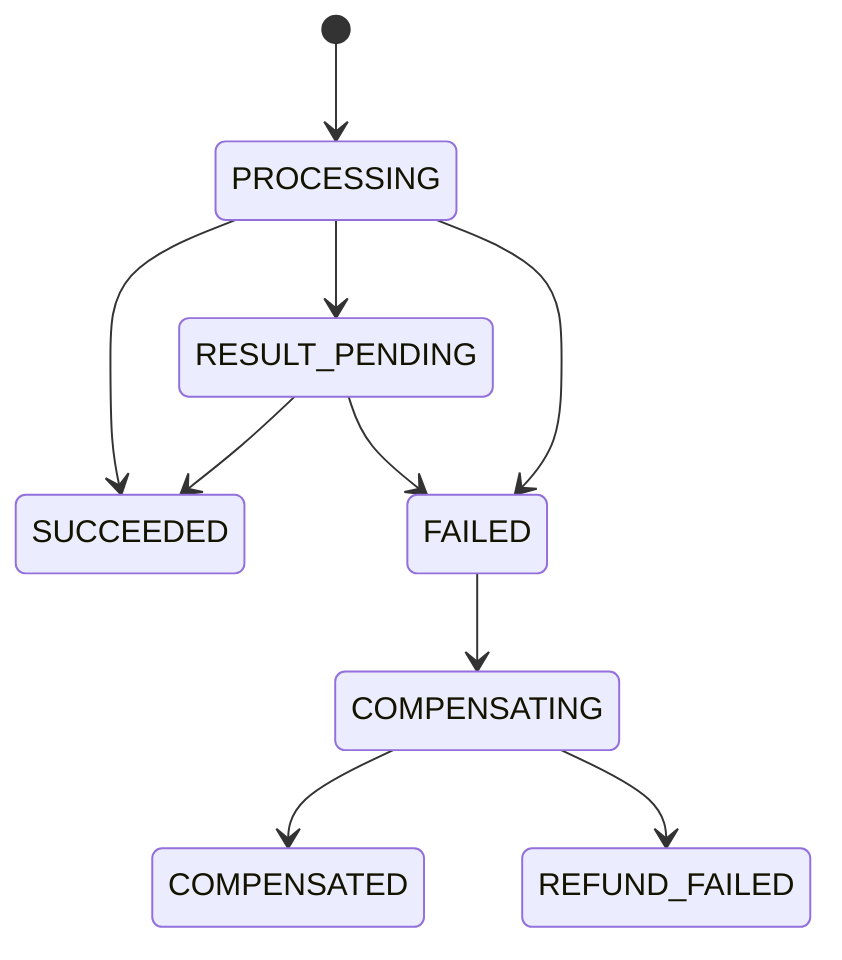
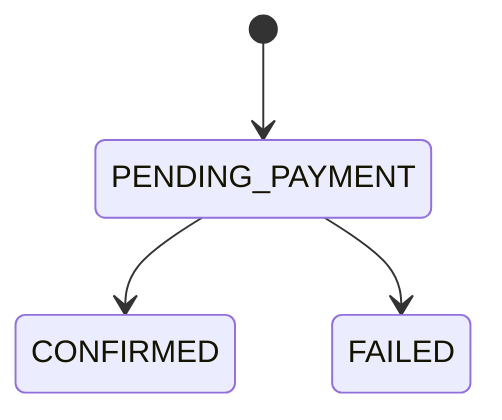
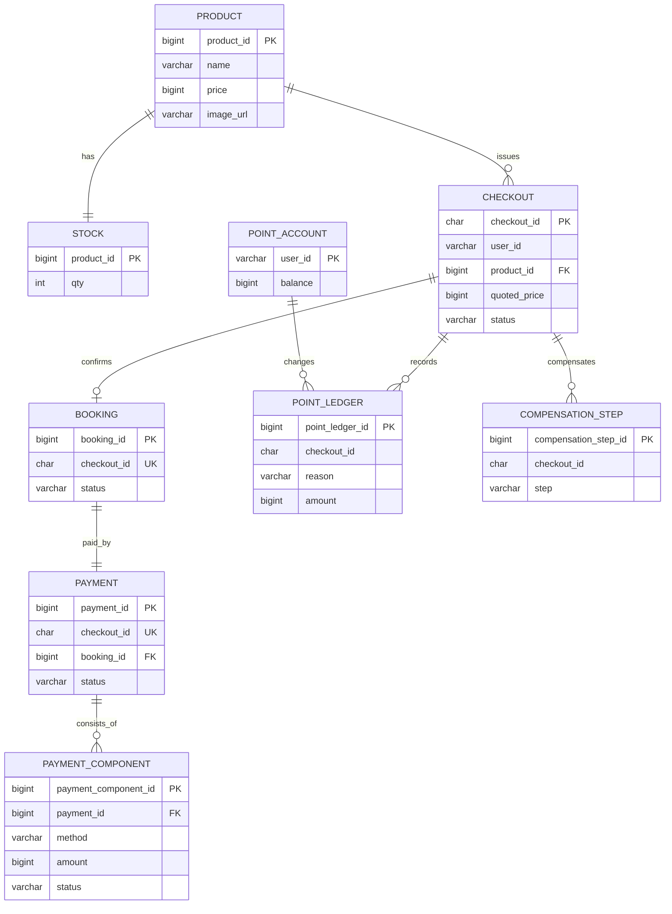

# DOMAIN

이 문서는 구현된 도메인 모델과 주요 흐름을 빠르게 확인하기 위한 참조 문서다.
결정 근거는 [DECISIONS.md](DECISIONS.md), 구현 순서는 [TASKS.md](TASKS.md)를 본다.

## 필수 범위

| 요구 | 구현 |
|---|---|
| GET Checkout | 상품 정보, 가격, 입/퇴실 시간, 대표 이미지, 사용 가능 포인트, checkoutId 발급 |
| POST Booking | checkoutId 기반 예약/결제/재고 선점 |
| 재고 10개 정합성 | Redis gate + DB 조건부 UPDATE |
| 선착순 공정성 | Redis gate 도달 순서 기준 |
| 멱등성 | checkoutId + Redis SETNX + DB unique |
| 결제 수단 | CARD, Y_PAY, POINT |
| 복합 결제 | CARD+POINT, Y_PAY+POINT |
| 결제 실패 | 확정 실패는 보상, 결과 불명은 PG 조회 |
| Redis 장애 | DB 우회 없이 `503 + Retry-After` |

## 제외 범위

- 회원가입 / 로그인 / 권한 시스템
- 실제 PG SDK
- 쿠폰, 장바구니, 정산, 매출 리포트
- 사용자 취소 / 환불 정책
- 대기열 UI, SSE, polling
- 잔여 재고 사용자 노출
- 관리자 API
- Redis Cluster 기본 구성

## 도메인 경계

| 영역 | 책임 | 주요 클래스/테이블 |
|---|---|---|
| Catalog | 상품 조회 | `product` |
| Checkout | 주문서 발급과 가격/포인트 snapshot | `checkout` |
| Inventory | Redis gate와 DB 재고 | `stock`, `stock:{productId}`, `hold:{checkoutId}` |
| Booking | 예약 상태 | `booking` |
| Payment | 결제 조합, 실행, 결과 조회 | `payment`, `payment_component` |
| Point | 포인트 차감/복구 | `point_account`, `point_ledger` |
| Compensation | 실패 보상 단계 기록 | `compensation_step` |

## 핵심 모델

### Product

- `productId`
- `name`
- `price`
- `imageUrl`
- `checkInAt`
- `checkOutAt`
- `salesOpenAt`

### Checkout

- `checkoutId`
- `userId`
- `productId`
- `quotedPrice`
- `availablePointSnapshot`
- `status`: `ISSUED`, `USED`, `EXPIRED`
- `expiresAt`

규칙:

- GET Checkout은 비멱등이다.
- POST Booking은 checkoutId 기준으로 멱등이다.
- 만료된 Checkout은 결제에 사용할 수 없다.

### Stock

- `productId`
- `qty`

규칙:

- DB `stock.qty`가 최종 진실이다.
- 최종 선점 SQL:

```sql
UPDATE stock
SET qty = qty - 1
WHERE product_id = ? AND qty > 0
```

### Booking

- `bookingId`
- `checkoutId`
- `userId`
- `productId`
- `status`: `PENDING_PAYMENT`, `CONFIRMED`, `FAILED`
- `totalAmount`

규칙:

- `checkoutId`는 unique다.
- DB 재고 선점, Booking `PENDING_PAYMENT`, Payment `PROCESSING` 생성은 같은 DB 트랜잭션에서 수행한다.
- 외부 PG 호출은 이 트랜잭션 커밋 이후에 한다.

### Payment

- `paymentId`
- `checkoutId`
- `bookingId`
- `userId`
- `status`
- `totalAmount`
- `pgIdempotencyKey`

상태:

| 상태 | 의미 |
|---|---|
| `PROCESSING` | 결제 처리 중 |
| `RESULT_PENDING` | PG 결과 조회 대기 |
| `SUCCEEDED` | 결제 성공 |
| `FAILED` | 결제 확정 실패 |
| `COMPENSATING` | 보상 진행 중 |
| `COMPENSATED` | 보상 완료 |
| `REFUND_FAILED` | 보상 실패 |

### PaymentComponent

- `method`: `CARD`, `Y_PAY`, `POINT`
- `amount`
- `status`: `PENDING`, `SUCCEEDED`, `FAILED`
- `externalTransactionId`

허용 조합:

- `CARD`
- `Y_PAY`
- `POINT`
- `CARD + POINT`
- `Y_PAY + POINT`

금지:

- `CARD + Y_PAY`
- 같은 결제 수단 중복
- 금액 합계 불일치

### Point

- `point_account`: 사용자별 잔액
- `point_ledger`: 포인트 변경 이력

`point_ledger(checkout_id, reason)` unique 제약으로 포인트 차감/복구를 멱등 처리한다.

| reason | 의미 |
|---|---|
| `BOOKING_USE` | 결제 사용 |
| `BOOKING_REFUND` | 결제 실패 보상 |
| `BOOKING_RESTORE` | 예비 복구 사유 |

### Compensation

보상은 checkoutId 기준으로 다음 단계를 한 번씩만 수행한다.

| step | 의미 |
|---|---|
| `POINT_REFUNDED` | 포인트 복구 |
| `DB_STOCK_RESTORED` | DB stock 복구 |
| `REDIS_GATE_RESTORED` | Redis hold 해제 및 gate 복구 |

`compensation_step(checkout_id, step)` unique 제약으로 중복 복구를 막는다.

## 주요 흐름

### GET /checkout

1. `X-User-Id`를 읽는다.
2. 상품과 사용자 포인트를 조회한다.
3. checkoutId를 발급한다.
4. 상품 정보, 사용 가능 포인트, `expiresAt`을 응답한다.

잔여 재고 수량은 응답하지 않는다.

### POST /bookings

1. `SETNX idempotency:{checkoutId}`로 중복 요청을 차단한다.
2. Checkout 사용자, 상태, 만료 여부를 검증한다.
3. 결제 조합과 금액 합계를 검증한다.
4. Redis Lua로 `stock:{productId}`를 차감하고 `hold:{checkoutId}`를 만든다.
5. DB 트랜잭션에서 stock 조건부 UPDATE, Booking `PENDING_PAYMENT`, Payment `PROCESSING`을 생성한다.
6. 트랜잭션 커밋 후 결제를 호출한다.
7. 결제 성공이면 Booking `CONFIRMED`, Checkout `USED`로 마감한다.
8. 결제 확정 실패면 Payment `FAILED` 후 보상을 실행한다.
9. PG 결과 불명이면 Payment `RESULT_PENDING`으로 두고 결과 조회 잡이 이어서 처리한다.
10. 최종 응답을 `idempotency:result:{checkoutId}`에 저장한다.

## 실패 처리

| 상황 | 응답/처리 |
|---|---|
| Checkout 없음 | `404` |
| 사용자 불일치 | `403` |
| Checkout 만료 | `400` |
| 결제 조합/금액 오류 | `400` |
| Redis gate 거절 | `409 SOLD_OUT_OR_PROCESSING` |
| DB 재고 선점 실패 | Redis gate 복구 후 `409 SOLD_OUT_OR_PROCESSING` |
| Redis 장애 | `503 REDIS_UNAVAILABLE`, `Retry-After` |
| 결제 확정 실패 | stock/Redis/point 보상 후 `FAILED` |
| PG 결과 불명 | `PENDING`, 이후 결과 조회 |
| 보상 실패 | `REFUND_FAILED`, 같은 checkoutId로 재실행 가능 |

## 상태 전이





## ERD



전체 DDL은 [../src/main/resources/schema.sql](../src/main/resources/schema.sql)에 있다.

## Redis 키

| 키 | 값 | TTL | 용도 |
|---|---|---|---|
| `stock:{productId}` | 남은 gate token 수 | 없음 | 빠른 거절 |
| `hold:{checkoutId}` | productId, userId | 30분 | 진행 중 표시와 보상 힌트 |
| `idempotency:{checkoutId}` | `processing` / `done` | 24시간 | 중복 POST 차단 |
| `idempotency:result:{checkoutId}` | 응답 JSON | 24시간 | 멱등 응답 재생 |

Redis는 DB의 대체 진실이 아니다.
Redis 유실 또는 장애 시 DB로 우회하지 않는다.

## 검증과 관측

기본 검증:

```bash
./scripts/test-consistency.sh
./scripts/test-idempotency.sh
./scripts/test-all.sh
```

노출 메트릭:

- `redis.gate.success`
- `redis.gate.failure`
- `db.stock.reserve.success`
- `db.stock.reserve.failure`
- `booking.confirmed`
- `payment.failure`
- `http.503`
- `compensation.refund_failed`

제외:

- Prometheus remote-write / Grafana dashboard 기본 제공
- k6 spike / Redis 장애 자동 시나리오
- 운영자용 잔여 재고 API
